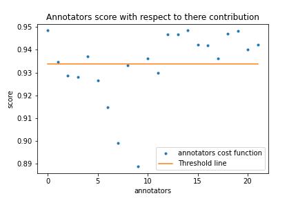

# Bicycle Project Crowd Evaluation

Noha Abdelkarim

July 23, 2021

---

# Outline
* Creating a comprehensive insight about the annotators who contribute to the dataset
* Analyzing the usage of 'cant_solve' and 'corrupt_data' options by the annotators
* Checking if the reference dataset is balanced or not
* Assessing the annotators' performance by using the reference dataset
* Conclusion

---

# Creating a comprehensive insight about the annotators who contribute to the dataset
1. Calculating the number of annotators who contributes to the dataset  
The number of annotators is calculated through reading the 'vendor_user_id' column in the results.csv file which corresponding to the annotator responses json file. Then, the count is determined by getting the length of the vendor_user_id list without repetition. Accordingly, 22 annotators are found who contributing to the dataset.
2. Calculating the average, min and max annotation times  
Firstly, the annotation times are read from the 'duration_ms' column in the results.csv file. Secondly, the positive time list is determined to remove any initial value which has a negative sign as time can not be a negative number. Finally, the average, min and max annotation times are determined which are: 
The average annotation time = 1289.9214 ms 
The max annotation time = 42398 ms 
The min annotation time = 10 ms 
3. Calculating the amount of contribution for each annotator  
The amount of contribution for each annotator is calculated by using 'vendor_user_id' column and illustrated in Figure 1. As shown in the figure, the annotators participate with a different amount of contributions. 

4. Checking if there are questions for which annotators highly disagree  
For this task to be achieved, the answers of the annotators in each question are read and shaped into a matrix to organize the answers of each question in a separate row. Then, each row in the matrix is scanned to calculate the amount of similarity in each question answer. Finally, the questions for which annotators highly disagree are determined by getting the ID of the questions which have similar answers with only 50%. Finally, 68 questions are determined and saved in a file called 'questions_highly_disagree.csv'.  

---

# Analyzing the usage of 'cant_solve' and 'corrupt_data' options by the annotators
To analyze the usage of the 'cant_solve' and 'corrupt_data' options, the corresponding columns to them are read from the results.csv file. Then, the lists of both options are scanned to determine how often does each occurs and the ID of the annotators that made use of these options. Accordingly, the 'cant_solve' and 'corrupt_data' options were found to be used 17 and 4 times respectively. The IDs' of the annotators that used cant_solve and corrupt_data fields more than or equal three times are annotator_4, annotator_8, annotator_18 and annotator_22. So, most likely, there is a trend between those annotators to use cant_solve and corrupt_data fields.  

---

# Checking if the reference dataset is balanced or not
The reference dataset would be considered to be balanced if the number of examples in the True class is approximately equal to the number of examples in the False class. In this regard, the number of examples in each class are counted and the reference answers distribution is shown in Figure 2. As shown in the figure, the reference dataset is balanced as it has approximately equal number of examples for both True and False classes.  

---

# Assessing the annotators' performance by using the reference dataset

This can be achieved by using the reference dataset and compare the reference answer of each question with the annotators' answers which participate in the annotation of the same question. Then, a score '1' is given for the annotator's right answer and '0' is given for the wrong answer. Afterwards, the score of each annotator would be calculated by summing his\her score in all contributions. Finally, the cost function is determined by calculating the ratio of the annotators' scores over their number of contributions.  The cost function of each annotator is demonstrated in Figure 3. To determine the bad and good annotator, a threshold is calculated by calculating the average cost function, and the annotators which have cost function above the threshold are considered to be good, and the annotators which have cost function below the threshold are considered to be bad.  

---
 # Conclusion
 
 1. The evaluation of the quality and the performance of a crowd of annotators in the bicycle project dataset is tackled in this project. 
 2. Insights were gathered about the annotators which resulted in that the dataset has 22 annotators participate with a different amount of contributions with average annotation time = 1289.9214 ms, max annotation time = 42398 ms and min annotation time = 10 ms. Moreover, 68 questions for which annotators highly disagree are found. 
 3. The amount of usage of 'cant_solve' and 'corrupt_data' options by the annotators was determined and a trend between 'annotator_4, annotator_8, annotator_18 and annotator_22' annotators to use those fields was detected. 
 4. The answers distribution in the reference dataset was determined which demonstrates that the reference dataset is balanced. 
 5. The good and bad annotators were determined by comparing the annotator answers with the reference answers. 
 
 

